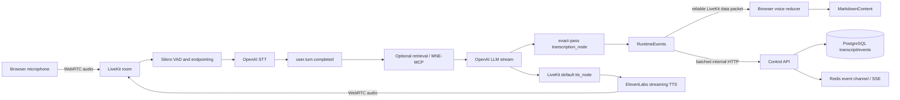

# Assistant stream spacing diagnosis

Status: corrected and verified in production  
Assessment date: 2026-07-21  
Affected path: controlled browser voice pipeline

## Resolution contract

The correction removes all word-boundary inference and defines these event
semantics:

- `assistant.text.delta.payload.text` is an opaque, append-only fragment. The
  voice agent, API, and browser must preserve its whitespace exactly.
- `assistant.text.completed.payload.text` is the authoritative normalized full
  message and replaces the matching streamed draft.
- The TTS path receives the original ordered LLM chunks through LiveKit's
  default streaming node.

The provider stack, VAD, endpointing, Markdown rendering, and ElevenLabs latency
tuning are unchanged.

Production verification completed on immutable image tag
`eea038808389-stream-boundaries-202607211657`. API and web traffic were both
confirmed at 100% on the matching ready revisions. The authenticated smoke test
observed greeting text, assistant audio, and a remote audio track. A synthetic
Croatian microphone turn then exercised STT, LLM streaming, and TTS; the visible
response preserved whole words including `pasoš`, `izgubljen`, `ukraden`,
`prijavi`, `ambasadi`, and `konzulatu`.

## Executive summary

The malformed assistant text was caused by treating streamed LLM chunks as
complete words. They are not complete words: they are arbitrary token fragments
and may split inside a word.

The captured events contain enough evidence to identify the failure. The dev
panel displays newest events first, so the chronological stream is read from
event 40 toward event 1. Examples from that stream are:

```text
"kra" + "đe"              -> "krađe"
" ho" + "će" + "š"        -> " hoćeš"
" slo" + "ž" + "iti"      -> " složiti"
" prakti" + "čno"         -> " praktično"
" pon" + "ese" + "š"       -> " poneseš"
" š" + "alter" + "u"      -> " šalteru"
```

These are normal model stream boundaries. The former `VoiceStreamStitcher`
inserts a space whenever one chunk ends in a letter and the next begins with a
letter. That changes the examples into `kra đe`, `ho će š`, `slo ž iti`, and
similar broken words.

This transformation was applied twice in the voice agent, independently:

- `MontenegrinAgent.transcription_node` changes the assistant text events.
- `MontenegrinAgent.tts_node` changes the text sent to ElevenLabs.

The browser then applied a second equivalent heuristic while joining
`assistant.text.delta` events. It can also retain the over-spaced streamed draft
instead of a correct `assistant.text.completed` value. Therefore the defect can
affect both visible text and spoken audio, and a correct final event is not
guaranteed to repair the bubble.

This is not a Markdown rendering issue. Markdown correctly renders the string it
receives; the string is already corrupted before rendering.

## Current architecture



### Browser live path

The playground receives `montenegrina.events` directly from LiveKit in
`apps/web/app/components/playground/playground-view.tsx`. It immediately sends
handled events to the reducer in `apps/web/app/lib/voice-transcript.ts`.

The event panel prepends each new event and keeps the newest 40. Its displayed
numbers are positions in the current newest-first list, not the runtime event
sequence. This is important when reconstructing chunk order.

### Voice-agent text path

LiveKit Agents 1.5.17 passes an asynchronous sequence of text segments to
`transcription_node` and `tts_node`. Segment boundaries are transport/model
boundaries; they carry no word-boundary meaning. Leading whitespace is part of
the stream protocol and must be preserved.

At the time of the incident, the custom nodes each created a separate
`VoiceStreamStitcher`:

```text
LLM chunk stream
  -> VoiceStreamStitcher -> assistant.text.delta
  -> VoiceStreamStitcher -> ElevenLabs input
```

`RuntimeEvents.emit` publishes each event directly to the LiveKit room and also
queues it for batched delivery to the control API.

### Durable and SSE path

The API receives batches in `ConversationsService.appendRuntimeEvents`, stores
durable event types, and publishes accepted events to Redis for SSE consumers.
The affected API also called `processMontenegrin` independently on every
`assistant.text.delta`. That function trims its input. This is a secondary
stream-contract violation because a valid chunk such as `" ho"` becomes
`"ho"`.

The playground uses the direct LiveKit data path, so this API trimming
does not explain the captured browser session. It can, however, reproduce the
original missing-space problem in any client that consumes the API/SSE event
path.

## Confirmed failure points

### 1. Backend word-boundary inference corrupts subword tokens

Location: `apps/voice-agent/src/montenegrina_voice_agent/language.py`

`needs_stream_space` returns true for any letter/number boundary. There is no
reliable way to distinguish these two cases from adjacent chunks alone:

```text
"LLM" + "je"       # intended words only if the provider omitted a space
"paso" + "š"       # one word split across tokens
```

The stream itself already represents the distinction: a real word boundary is
normally carried as leading or trailing whitespace in a chunk. Guessing a
boundary discards that information.

### 2. TTS receives the same corrupted text

Location: `MontenegrinAgent.tts_node` in
`apps/voice-agent/src/montenegrina_voice_agent/agent.py`

The TTS node applies `VoiceStreamStitcher` before calling LiveKit's default TTS
node. ElevenLabs is therefore asked to synthesize `paso š`, not `pasoš`. This can
produce unnatural pauses, stress, or pronunciation even if the browser display
is fixed separately.

### 3. The browser repeats the unsafe heuristic

Location: `needsAssistantSpace` and `appendAssistantDelta` in
`apps/web/app/lib/voice-transcript.ts`

The browser inserts another space at letter-to-letter boundaries. Removing only
the Python stitcher would still leave the UI vulnerable to `kra` + `đe` becoming
`kra đe`.

### 4. Final-message selection can preserve the corrupted draft

Location: `bestAssistantFinalText` in
`apps/web/app/lib/voice-transcript.ts`

If the compacted streamed and final strings are equal, the reducer chooses the
version with more whitespace. For example:

```text
streamed: "izgub io paso š"
final:    "izgubio pasoš"
```

Both compact to the same characters, so the current rule chooses the malformed
streamed value. This prevents an authoritative final event from repairing the
message.

### 5. API normalization trims transient deltas

Location: `normalizedTextEvents` and `normalizeRuntimeEventText` in
`apps/api/src/conversations/conversations.service.ts`

`assistant.text.delta` is processed as if it were a standalone document.
`processMontenegrin` collapses whitespace and calls `trim()`, which destroys
leading spaces that are meaningful only when the chunks are concatenated.

## Factors that are not the primary cause

- OpenAI is expected to stream subword fragments. Different model clients may
  produce different chunk sizes, but those boundaries are not malformed output.
- LiveKit reliable data packets preserve the event payload shown in the dev
  panel. The panel proves the extra spaces already exist in emitted deltas.
- ElevenLabs does not generate the displayed text. It receives already modified
  text from `tts_node`.
- `MarkdownContent` affects presentation only. It cannot reconstruct words after
  spaces have been inserted inside them.
- Montenegrin diacritics are not the problem. The same bug occurs with ASCII
  token splits such as `"alter"` + `"native"`.

Changing the OpenAI model or TTS voice may alter chunk boundaries and make the
symptom appear more or less often, but it would not fix the contract violation.

## Safe correction design

The invariant for streamed assistant text should be:

```text
concatenated output == concatenation of provider chunks after only
length-preserving, chunk-safe script conversion
```

Recommended changes:

1. Remove inferred-space insertion from the voice agent. Preserve each incoming
   chunk's whitespace exactly in both `transcription_node` and `tts_node`.
2. Remove inferred-space insertion from the browser. Join deltas with direct
   concatenation: `previous + current`.
3. Treat `assistant.text.completed` as the authoritative final message and
   replace the streamed draft with it when present.
4. Do not run document-level normalization on individual deltas in the API.
   Either bypass `assistant.text.delta` or use a stream-safe transform that does
   not trim or infer whitespace.
5. Apply whitespace cleanup, punctuation cleanup, and full language processing
   only after the whole assistant message is complete.
6. Keep script conversion chunk-safe. If normalization can depend on adjacent
   code points, buffer only the minimal undecidable suffix rather than guessing
   word boundaries.

There is no generally correct heuristic that can recover spaces after an
upstream component has removed them. The source stream or a complete final
message must remain authoritative.

## Diagnostic procedure

For each failing turn, collect these artifacts under one `speechId`:

1. Raw LLM chunks before `transcription_node` and `tts_node`.
2. Emitted `assistant.text.delta` payloads with runtime `sequence`.
3. Exact concatenation of those payloads without normalization.
4. `assistant.text.completed` payload.
5. Exact text submitted to ElevenLabs.
6. Final browser reducer content.

Compare the values at each boundary:

```text
raw LLM join
  == emitted delta join
  == TTS input join
  == completed text
  == final UI text
```

The first inequality identifies the component that changed the text. Log chunk
values with escaped whitespace during development, for example
`JSON.stringify(chunk)`, because ordinary console output hides leading spaces.
Do not log provider keys, room tokens, cookies, or unrestricted production
transcripts.

For the current incident, the first known inequality is inside
`VoiceStreamStitcher.push`: the raw model boundary `"kra" + "đe"` becomes
`"kra" + " đe"`.

## Regression test matrix

Replace the existing bare-word fixture with token-fragment fixtures that model
the actual provider contract.

```text
["Nar", "avno", ".", " Ako", " ho", "će", "š", ",", " mogu"]
  -> "Naravno. Ako hoćeš, mogu"

["izgub", "io", " sam", " paso", "š"]
  -> "izgubio sam pasoš"

["LLM", " je", " skra", "ćenica", " za", " Large", " Language", " Model"]
  -> "LLM je skraćenica za Large Language Model"
```

Required coverage:

- Python unit test: stream normalization preserves exact boundaries.
- Python integration test: transcription and TTS consumers receive equivalent
  text when their streams are joined.
- Web reducer test: direct concatenation preserves subword and word boundaries.
- Web reducer test: completed text replaces a malformed or partial draft.
- API test: delta normalization preserves leading and trailing whitespace.
- Browser voice smoke test: assert a diacritic-heavy phrase in both delta join
  and completed UI text while also observing assistant audio.

The regression tests previously used arrays such as
`['LLM', 'je', 'skraćenica']`. That fixture encoded an invalid assumption that
every chunk is a complete word and rewarded the behavior that caused this
regression. It has been replaced with real token-fragment boundaries.

## Operational verification after correction

After deployment, start a new voice room and use a phrase likely to produce
subword tokens:

```text
Objasni šta treba uraditi kada je pasoš izgubljen ili ukraden.
```

Verify all of the following:

- The dev panel contains chunks such as `"paso"` + `"š"` without an inserted
  space.
- The visible final message contains `pasoš`, `hoćeš`, `prijaviš`, and
  `podneseš` as whole words.
- The spoken version does not pause inside those words.
- The completed event replaces the streaming draft.
- A transcript replayed through the API/SSE path matches the direct LiveKit
  browser transcript.

## Related latency note

The spacing correction should not require buffering the entire answer. Exact
chunk concatenation remains fully streaming and is cheaper than the current
heuristics. Endpointing, LLM first-token time, and TTS first-audio time remain
separate latency concerns and should continue to be measured independently.
