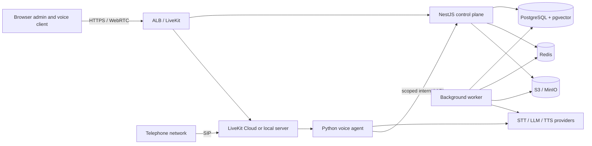
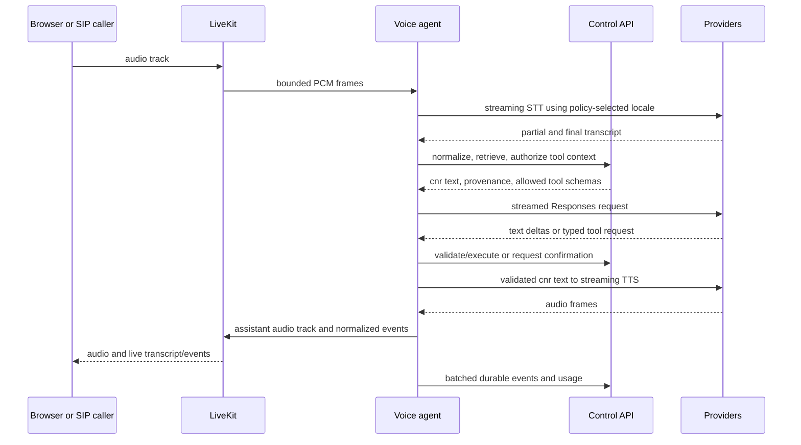

# Target architecture

## System context and trust boundaries

Clients, LiveKit, external AI providers, and company tool hosts are separate
trust boundaries. Browser clients receive only short-lived room tokens. The
realtime worker receives a conversation-scoped internal token and immutable
published agent configuration; it cannot administer organizations. Provider
credentials are environment or managed-secret references and never enter API
responses or ordinary logs.

## Component boundaries

- `apps/api`: authentication, tenancy, agent publication, provider policy,
  retrieval, tool authorization, audit, usage, durable conversations, and the
  public/internal contracts.
- `apps/web`: administration, text chat, browser voice, live events, evaluation
  comparison, and inspection. It uses only the generated SDK.
- `apps/voice-agent`: LiveKit media, VAD and endpointing, turn state, streaming
  providers, interruption, playback, and normalized runtime events.
- `apps/worker`: ingestion, embeddings, evaluation, retention, outbox delivery,
  deletion, and dead-letter handling.
- shared packages contain contracts, database access, configuration, language
  policy, normalized providers, observability, fixtures, and SDK output.

Provider SDK values stop at adapter boundaries. Cross-language runtime data is
defined with JSON Schema and generated into TypeScript and Python types.

## Realtime flow

Caller speech during `SPEAKING` cancels model/TTS work, flushes queued audio,
emits `assistant.interrupted`, and resumes listening. Final transcripts and
state transitions are never dropped; transient deltas may be dropped under
backpressure. Reconnects use Redis session state and the last durable sequence.

## Data and provider policy

Every tenant-owned row includes `organization_id`; application repositories
require tenant context and composite constraints prevent cross-tenant links.
Agent versions are immutable publication snapshots. PostgreSQL is authoritative;
Redis holds sessions, locks, queues, circuit breakers, quotas, and transient
state. Object storage contains source documents and opt-in recordings.

Routing resolves agent, organization/environment, then platform policy. It
filters candidates by domain, latency, provider, region, and data rules before
attempting them. Transient operations may be retried before visible output or a
side effect. A provider is never selected if it violates tenant policy. Partial
TTS failures become text-only or handoff rather than a mid-utterance voice swap.

## Scaling, failure, and deployment

API and web containers scale on request load, background workers on queue depth,
and voice workers on dispatched job/CPU load. Each realtime conversation is
owned by one voice job. PostgreSQL outbox records make background dispatch
recoverable; job IDs, event IDs, and idempotency records make repeated delivery
safe. Redis circuit breakers are shared by provider/model/region.

Local Docker Compose runs PostgreSQL/pgvector, Redis, MinIO, LiveKit, the four
applications, and an OpenTelemetry/Prometheus/Grafana/Jaeger stack. Staging uses
ECS/Fargate, RDS, ElastiCache, S3/KMS, Secrets Manager, ALB/ACM, and LiveKit
Cloud. SIP trunks and numbers remain externally supplied credentials.

## Privacy and retention

Ordinary logs contain IDs, timings, classifications, and redacted attributes,
not authorization headers, raw audio, or full sensitive transcripts. Audio
recording is disabled by default. Default retention is 30 days for transcripts,
7 days for opt-in audio, 365 days for audit/usage, and 90 days for evaluation
artifacts. Tenant deletion removes rows and object keys and leaves only a
content-free deletion receipt.

## Explicit decisions not to overengineer

- No Kubernetes, service mesh, Kafka, dedicated vector database, or one-service-
  per-provider topology for the initial product.
- No PostgreSQL RLS in the MVO; tenant-aware services, composite constraints,
  and isolation tests are mandatory instead.
- No arbitrary SQL, arbitrary model-selected URLs, or generic unrestricted MCP.
- No automatic claim that another South Slavic locale is Montenegrin and no
  hardcoded STT winner before evaluation.
- No self-hosted public media/SIP edge in staging and no model training.

